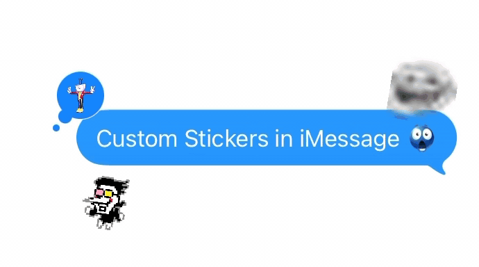

<div align="center">
  
</div>

Add custom images as stickers to iMessage

# StickerHack

Static stickers are effectively custom emojis, as they can be used inline.

Works on most PNGs and GIFs

Stickers sync across devices logged into the same account, so even though you need a Mac to import your stickers, you can use them on your iPhone/iPad too!

**Note that this thing is still not the most reliable and more updates will be coming soon™** especially for larger files and especially for GIFs, it can be quite unreliable. I will be looking into fixing some of these issues soon™ so please stay tuned :)

## Requirements

* A Mac running macOS that is signed into iMessage. I tested this on macOS 15.7.6, and it should work on all macOS versions supporting custom stickers (macOS Sonoma), but do let me know if it doesn't work on any macOS versions so I can update this README accordingly. You do **not** need SIP disabled or root access! (Although you do need root to install node...)
* An image file, PNG or GIF, under 1mb, although smaller is better
* Node.js (so you can install the package with npm)

## Quick start

**Installation**

```bash
npm i -g stickerhack
```

You can also run it with `npx stickerhack` (prepending npx before stickerhack in all occurances below) if you prefer.

**adding any image to your sticker library**

1. Get your image under 1mb (I haven't done too much experimentation yet, but from my testing, this is a good number to aim for when compressing); this is especially important for GIFs

```bash
stickerhack ./path/to/image.png
stickerhack ./path/to/image.gif
```

that's literally it! if you are having trouble contact me or make an issue or something

## Troubleshooting

If an image fails to convert, make sure it's a PNG or GIF. From my testing, I didn't encounter any errors with the converter, so if you do encounter any issues, please do let me know by creating an issue here :)

If the sticker converts successfully but appears in iMessage as a bugged blank sticker, that means you probably used a script to batch import a lot of stickers. After importing each sticker, we restart `stickersd`, so if you're importing a ton of stickers at once, you'll want to import them all before restarting `stickersd` yourself. Set the env variable `export STICKERHACK_NO_RESTART=1` and StickerHack won't restart `stickersd` each time. Then, once your script is done importing, either restart iMessage or just `killall stickersd` yourself.

If the sticker appears in the iMessage sticker picker properly, but when actually trying to use it doesn't work, that means your image was still too big, and if you compress it some more it should work. I encountered this the most with GIFs. <1mb seemed to be the sweet spot for me.

If you can't use your animated stickers inline, that's a limitation of iMessage. Only static stickers can be used inline as "custom emojis"

## Contributing

1. Make a pr
2. I review pr at my discretion (not guaranteed to be merged)
3. Don't be a dick about it

## Thanks!
